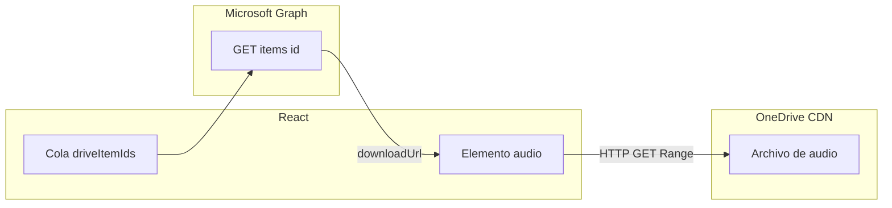
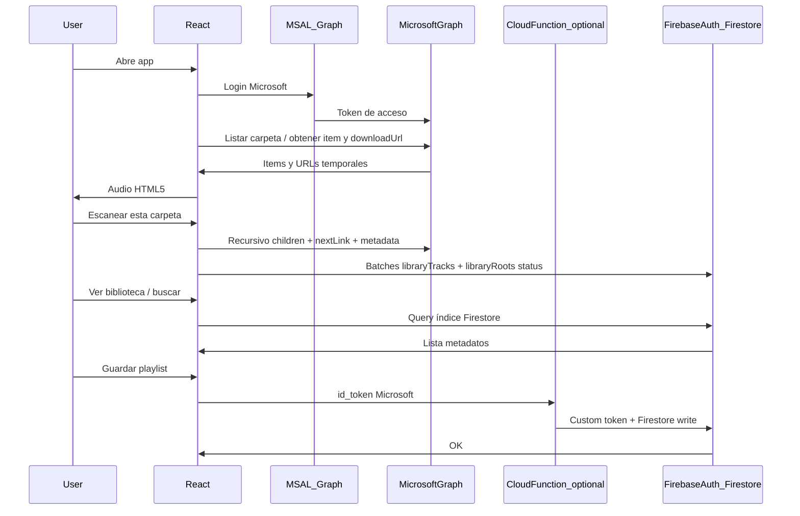

# Reproductor web con OneDrive + React + Firebase (fase 1)

## Checklist de implementación (seguimiento)

Marca ítems conforme avances el desarrollo.

- [ ] **azure-app** — Registrar SPA en Entra ID, permisos Graph (`Files.Read`, `User.Read`, `offline_access`), redirect URIs
- [ ] **react-msal** — Vite + React + TS, MSAL, login y llamadas a `/me/drive/...` con paginación
- [ ] **player** — Un `<audio>` HTML5, cola, `GET drive/items/{id}` para `downloadUrl`, renovar en error, formatos / Media Session opcional
- [ ] **firebase-setup** — Proyecto Firebase, Firestore (índice roots + tracks + stats), playlists secundarias, reglas; auth (Custom Token vía Function recomendado)
- [ ] **playlists-ui** — CRUD playlists, añadir tracks desde explorador, vista detalle y reproducción desde lista
- [ ] **folder-scan** — UI «Escanear esta carpeta», crawl Graph con paginación, batches Firestore, checkpoint en IndexedDB; ver sección PWA
- [ ] **pwa-optional** — Manifest + SW (instalable); evaluar Background Sync para reintentos cortos; no sustituye scan largo con app cerrada

## Objetivo de la fase 1

- Iniciar sesión con la cuenta de Microsoft donde está tu OneDrive.
- Usar **Firebase (Firestore) como índice**: entender **qué información tienes en OneDrive** (canciones conocidas, rutas lógicas, raíces escaneadas, conteos) sin duplicar los archivos de audio — solo **metadatos** sincronizados desde Graph al escanear.
- Navegar en vivo por carpetas cuando haga falta; **«Escanear esta carpeta»** alimenta y actualiza ese índice por ramas (no hace falta indexar los 200 GB de golpe: solo lo que marques).
- Reproducir pistas en el navegador (siempre el binario viene de OneDrive / Graph, no de Firebase).
- **Playlists** (estilo Spotify): capa de aplicación en Firestore — listas ordenadas de `driveItemId` que apuntan al mismo inventario indexado; la música sigue solo en OneDrive.

## Biblioteca por carpetas (escaneo) vs todo OneDrive

Con **200 GB**, no se indexa OneDrive entero por defecto. El flujo es:

1. **Explorador** (igual que antes): navegas por Graph hasta la carpeta donde tienes música (por ejemplo `Música/Albumes`).
2. Acción **«Escanear esta carpeta»** (y opcionalmente **«Incluir subcarpetas»** con un toggle claro): la app recorre en cliente la jerarquía con `GET .../items/{id}/children` + `@odata.nextLink` en cada nivel, filtra por extensiones de audio, y **escribe/actualiza el índice en Firestore**. Campos útiles para «saber qué tengo»: `driveItemId` (clave estable), `name`, `parentFolderId`, `rootId` (qué escaneo lo introdujo), ruta legible opcional, `lastModifiedDateTime`, `size` si Graph lo devuelve; si pides la faceta **`audio`** en Graph, también **artista / álbum / título / duración** cuando el archivo lo traiga incrustado (mejor UX de biblioteca sin leer el blob).
3. Puedes tener **varias raíces** (varias carpetas escaneadas); la «biblioteca» es la unión de esas ramas o la última escaneada, según definas en UI.

**Re-scan / actualizar**: misma carpeta otra vez: fusionar por `driveItemId` (actualizar nombre/ruta) y opcionalmente marcar como «huérfanos» los ids que ya no existan en Graph si haces un paso de limpieza (fase posterior).

**Límites**: escaneo largo en el navegador puede ser interrumpido si cierras la pestaña o el SO suspende el proceso; para catálogos enormes, una fase 2 sería **Cloud Function + cola** que haga el crawl con backoff. Para fase 1, escaneo en cliente con barra de progreso y **pausa / cancelar**, más **checkpoint** (cola de carpetas pendientes y cursores de paginación en IndexedDB) para **reanudar** tras recarga. Una **PWA** mejora instalación y UX pero **no** sustituye por sí sola un crawl fiable con la app cerrada (ver sección siguiente).

## PWA y escaneo en segundo plano

Convertir la app en **PWA** (manifest + service worker) vale la pena por **instalación en escritorio/móvil**, caché del shell y sensación «como app», pero **no convierte el navegador en un worker de larga duración** para un escaneo masivo.

- **Pestaña abierta pero en segundo plano**: el escaneo puede seguir mientras el sistema no suspenda o mate el proceso; muchos navegadores **reducen prioridad** del hilo principal. Recomendación: ejecutar el crawl en un **Web Worker** y persistir **checkpoints** (cola BFS/DFS, `nextLink` por carpeta, último batch a Firestore) en **IndexedDB** para reanudar. Esto aplica con o sin PWA.
- **Pestaña cerrada o app «cerrada»**: el **service worker** tiene tiempo de vida limitado; no está pensado para bucles largos de Graph + Firestore durante minutos u horas. El navegador puede detenerlo en cualquier momento.
- **Background Sync** (one-shot): útil para **reintentar** escrituras cortas cuando vuelve la red, no para indexado completo en frío.
- **Periodic Background Sync** (Chrome/Edge, a menudo con PWA **instalada** y permiso): intervalos típicamente de **horas**, útil para **deltas** posteriores, no para «sigue escaneando esta carpeta gigante ahora».
- **iOS (Safari / PWA)**: reglas más estrictas para trabajo en background; no depender de ello para el escaneo inicial.

**Conclusión**: PWA **sí** mejora producto; para «que siga escaneando con fiabilidad aunque el usuario cierre la app», la solución robusta sigue siendo **backend** (p. ej. Cloud Function + cola + estado en Firestore). En cliente, lo realista es **Worker + checkpoints + reanudación**; PWA + APIs de sync solo como **complemento** (reintentos cortos o sync periódico incremental).

## Índice (Firebase) vs listado en vivo (Graph)

- **Firestore** es la fuente de verdad de la app para **«qué tengo indexado»**: búsqueda, filtros, vistas de biblioteca, estadísticas (pistas por raíz, último escaneo). OneDrive sigue siendo la fuente de verdad del **archivo real**.
- **Listar en vivo** con Graph sigue sirviendo para carpetas aún no escaneadas, para corregir rutas antes de indexar, o para operaciones puntuales fuera del catálogo.
- **Playlists** referencian `driveItemId` (idealmente validados contra el índice o resueltos en Graph al reproducir).

## Reproducción de música (detalle)

El audio **nunca** pasa por Firebase: solo usas Firestore para saber **qué** reproducir (`driveItemId`); el **binario** lo sirve OneDrive vía una URL que obtienes de Graph.

### Cómo se obtiene la URL de reproducción

- Llamada típica: `GET https://graph.microsoft.com/v1.0/me/drive/items/{item-id}` con `$select` mínimo (p. ej. `id,name,file,@microsoft.graph.downloadUrl` o sin select si necesitas más facetas). La respuesta puede incluir **`@microsoft.graph.downloadUrl`**: URL **preautenticada** (estilo SAS) válida un tiempo limitado; el elemento `<audio>` puede usarla como `src` **sin** enviar el `Authorization: Bearer` de MSAL en esa petición (el token de Graph solo se usa para la llamada JSON a Graph).
- **Alternativa** menos cómoda para el reproductor: `GET .../items/{id}/content` sigue redirecciones hasta el blob; a veces se usa con `fetch` + blob URL, pero suele ser más simple y eficiente **`downloadUrl` + `<audio src>`** siempre que el navegador acepte el tipo MIME del archivo.

### Capa de reproductor en React

- **Un solo elemento** `<audio>` (o una instancia estable) como fuente de verdad: evitas solapar varias reproducciones y simplificas eventos.
- **Estado de aplicación** (Context, Zustand o similar): pista actual (`driveItemId`, título para UI), **cola** (`TrackRef[]`), índice en cola, `isPlaying`, `currentTime` / `duration` (sincronizados desde eventos del elemento con actualización razonable en `timeupdate`, p. ej. throttling a ~4–10 Hz para no re-renderizar en exceso).
- **Flujo al elegir una canción**: (1) si ya tienes `downloadUrl` fresca en memoria, asignas `audio.src` y llamas `play()`; (2) si no, llamas a Graph por `item-id`, lees `@microsoft.graph.downloadUrl`, asignas `src`, esperas `loadedmetadata` o `canplay`, luego `play()`; manejar `NotAllowedError` si el navegador exige gesto de usuario para autoplay.
- **Cola y «siguiente»**: en evento `ended` del `<audio>`, avanzas el índice en la cola, vuelves a resolver la siguiente pista con Graph (nueva `downloadUrl`) y actualizas `src`. «Anterior» requiere volver a pedir URL si la anterior ya expiró.
- **Pausa / seek**: `pause()`, `currentTime = …`; el streaming por **HTTP Range** suele estar soportado en las URLs de almacenamiento de OneDrive, así que la barra de progreso y el salto en el tiempo dependen del códec y del navegador más que de tu código.

### Caducidad y errores

- `downloadUrl` **caduca**: ante `error` en el elemento, o si detectas fallo al cargar tras mucho tiempo pausado, **repite** `GET /me/drive/items/{id}` y sustituye `src` por la nueva URL (con backoff ligero si hay red intermitente).
- Si el archivo fue **borrado o movido** en OneDrive, Graph devolverá error: mostrar mensaje y pasar a la siguiente en cola o detener.

### Formatos y compatibilidad

- **MP3, AAC (m4a), OGG, WAV**: soporte variable; **FLAC** depende del navegador (p. ej. Chrome sí en muchos casos; Safari cambia con el tiempo). Conviene comprobar `audio.canPlayType` o la extensión/MIME y mostrar aviso si no es reproducible.
- No hay transcodificación en fase 1: lo que OneDrive almacena es lo que el navegador intenta decodificar.

### Extras opcionales en fase 1

- **Media Session API** (`navigator.mediaSession`): título, artista, álbum y controles en pantalla de bloqueo / notificación cuando los metadatos vengan del índice o de la faceta `audio` de Graph.
- **Precarga**: opcionalmente, cuando empiece una pista, pedir en segundo plano el `driveItem` de la **siguiente** para tener `downloadUrl` lista al hacer `ended` (sin reproducir aún).

### Resumen

## Piezas técnicas

### 1. Microsoft Graph + OneDrive

- Registrar una **aplicación en Microsoft Entra ID (Azure AD)** como **SPA** (single-page application).
- Habilitar **URI de redirección** (por ejemplo `http://localhost:5173` con Vite).
- Permisos delegados típicos: `Files.Read` o `Files.Read.All` (según si solo tu cuenta o cuentas de org), `User.Read`, y `offline_access` si vas a refrescar tokens en cliente con [MSAL.js](https://github.com/AzureAD/microsoft-authentication-library-for-js).
- API útil:
  - **Reproducción y metadatos de un archivo**: `GET /me/drive/items/{id}` → `@microsoft.graph.downloadUrl` para `<audio src>`; repetir la petición si la URL caduca o el elemento `audio` dispara error (detalle en **Reproducción de música**).
  - **Listado de carpetas**: `GET /me/drive/root/children` o `.../items/{folder-id}/children` con `$top` y `@odata.nextLink`.
  - Opcional: `GET .../items/{id}/content` (redirecciones al blob); en fase 1 suele bastar **`downloadUrl`** sin proxy.

### 2. React (UI)

- Stack recomendado: **Vite + React + TypeScript**, enrutador (React Router) si separas Login / Biblioteca / Playlist.
- Pantallas mínimas fase 1:
  - **Login / logout** Microsoft.
  - **Explorador**: árbol o breadcrumb + lista; **«Escanear esta carpeta»** (toggle subcarpetas); acciones «añadir a cola» / «añadir a playlist» desde ítem o desde filas del índice.
  - **Biblioteca (índice)**: vista principal sobre Firestore — lista/búsqueda de lo indexado, filtros (por raíz, extensión, artista si existe en faceta), contadores y **re-escaneo** por raíz.
  - **Reproductor**: un `<audio>` + estado de cola; resolver URL vía Graph (`@microsoft.graph.downloadUrl`); play/pause/seek/siguiente; ver sección **Reproducción de música**.
  - **Playlists**: CRUD y detalle con reordenar (p. ej. `@dnd-kit`); entradas son referencias a pistas conocidas (del índice).

### 3. Firebase (rol principal: índice de OneDrive)

- **Firestore** es el **catálogo de metadatos** que tú controlas: qué canciones has visto al escanear, bajo qué raíz, y con qué etiquetas devolvió Graph. **No** almacena audio; sirve para **consultar y entender tu biblioteca** en la app.
- Estructura sugerida (todo con `ownerUid` o bajo `users/{uid}/...` según reglas):
  - **`libraryRoots`**: cada carpeta que eliges escanear — `folderDriveItemId`, `displayPath`, opciones de recursión, `lastScan*`, `indexedTrackCount`, `scanStatus`.
  - **`libraryTracks`** (o subcolección por usuario): **un documento por archivo de audio indexado**, id = `driveItemId` — campos mínimos más faceta opcional: `name`, `parentFolderId`, `rootId`, `ext` o `mimeType`, `size`, `lastModifiedDateTime`, y si Graph lo expone en el ítem: `audio.title`, `audio.artist`, `audio.album`, `audio.duration` (los nombres exactos siguen el recurso `driveItem` de Graph).
  - **`playlists`** (secundario): `{ name, orderedTrackIds[], createdAt, updatedAt }` donde cada id es un `driveItemId` del índice (o se valida contra Graph si aún no está indexado).
- Escrituras en **batches** (límite 500 ops) durante el escaneo para no bloquear la UI; documento agregado opcional `libraryStats` (totales por extensión / por raíz) actualizable al finalizar un escaneo.
- **Firebase Authentication**:
  - Opción A (simple): **solo Microsoft** en el cliente con MSAL y usar **Firestore rules** que confíen en un **Custom Token** emitido por un backend mínimo (Cloud Function) que valide el `id_token` de Microsoft y cree el usuario Firebase — así `request.auth.uid` en reglas es coherente.
  - Opción B (MVP más rápido pero menos «Firebase puro»): playlists keyed por **Microsoft `oid`** (object id) y reglas que solo permitan lectura/escritura si el cliente envía ese id… **cuidado**: sin Custom Token, cualquiera que adivine un `oid` podría escribir; para uso personal en localhost a veces se acepta, pero **no para producción**.
  - Recomendación para algo serio: **Custom Token** vía **Callable Function** o endpoint pequeño que verifique el JWT de Microsoft y devuelva token Firebase.

- **No** uses Firebase Storage para los 200 GB de música en esta fase; OneDrive ya es el almacén.

### 4. Flujo de datos (alto nivel)

## Orden de implementación sugerido

1. Proyecto Vite + React; integrar **MSAL** y pantalla de login; probar llamada a Graph (`/me`, `/me/drive/root/children`).
2. UI de **explorador de carpetas** con paginación y filtro por extensión de audio.
3. **Escanear carpeta**: cola BFS/DFS (idealmente en **Web Worker**), checkpoints en **IndexedDB** para reanudar, límites de concurrencia bajos respecto a Graph, batches Firestore, UI de progreso y cancelación; persistir `libraryRoots` + `libraryTracks`.
4. Vista **Biblioteca** leyendo el índice (búsqueda simple por nombre en cliente o query por prefijo si modelas campos).
5. **Reproductor** (ver sección **Reproducción de música**): `<audio>` + cola, resolución y renovación de `downloadUrl`, controles y formatos.
6. Proyecto **Firebase**: Firestore con colecciones de **índice** primero (`libraryRoots`, `libraryTracks`, stats opcional), reglas acorde; auth (Custom Token recomendado).
7. CRUD de **playlists** (sobre `driveItemId` del índice) y reproducción resolviendo cada track con Graph por `id`.
8. **Opcional**: PWA (`manifest`, service worker, p. ej. `vite-plugin-pwa`); documentar límites de background (sección PWA); valorar Background Sync solo para reintentos cortos a Firestore.

## Riesgos y mitigaciones

| Riesgo | Mitigación |
|--------|------------|
| `downloadUrl` caduca | Re-fetch del item al fallar o antes de `expires` si Graph lo expone en tu respuesta |
| Límites de tasa Graph | Paginación; escaneo secuencial o poca concurrencia; backoff si recibes 429 |
| Pestaña cerrada o proceso suspendido durante escaneo | **Checkpoint + reanudar** (IndexedDB); PWA no garantiza crawl largo con app cerrada; fase 2: scan en backend |
| Formatos no soportados por el navegador | Detectar MIME/extension; mensaje claro (p. ej. FLAC depende del navegador) |
| CORS | Graph JSON no suele ser problema; el `audio` carga desde la URL de descarga, no desde Graph API directamente en muchos casos |

## Entregables de la fase 1

- App local (y desplegable en hosting estático: Vercel/Netlify/Firebase Hosting).
- Registro de app Azure documentado (IDs, redirect URIs).
- Firestore con **modelo de índice** (raíces + pistas + opcional stats), playlists como capa adicional, y reglas seguras acordes a la opción de auth elegida.
- Reproductor funcional (OneDrive vía Graph + HTML5 audio) con cola básica y manejo de URL caducada (sección **Reproducción de música**).
- Opcional: **PWA** (manifest + service worker) y documentación de expectativas de background (ver sección dedicada).

---

*Siguiente paso de ingeniería: inicializar el repo en la raíz del proyecto (`npm create vite@latest`, Firebase CLI, etc.) e implementar en el orden anterior. Actualiza `last_updated` en el frontmatter cuando modifiques este documento.*
